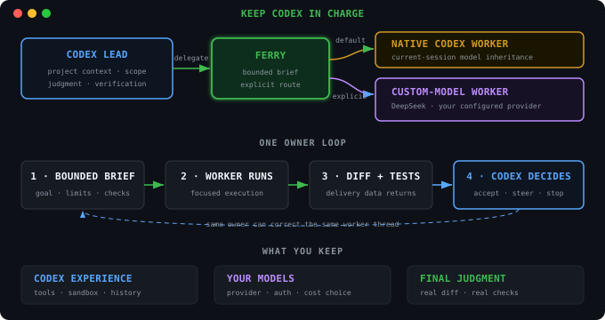

# Ferry

<p align="center">
  <strong>Keep Codex. Spend less.</strong>
</p>

<p align="center">
  English · <a href="README.zh-CN.md">简体中文</a>
</p>

<p align="center">
  <a href="https://pypi.org/project/ferry-codex/"></a>
</p>

Ferry lets Codex delegate bounded implementation work to native workers or
custom models you already configured. Your main Codex session keeps the project
context, controls the work, and makes the final call.

## Install

Requirements: Python 3.10+, an existing Codex CLI installation, and either `uv`
(recommended) or `pipx`.

Use exactly one package manager for Ferry. `uv tool` is the default path:

```sh
uv tool install ferry-codex
ferry setup
```

`pipx` remains a supported alternative; do not install the same Ferry package
with both managers.

```sh
pipx install ferry-codex
ferry setup
```

Start a fresh Codex session. Ferry reuses your host `codex` executable; it does
not bundle Python or install a second Codex CLI.

## Use

Ask Codex in natural language. There are no Ferry worker commands to learn.

Delegate to a native Codex worker:

```text
Use Ferry to delegate this bounded task to a native worker: update the parser,
run its focused tests, and do not touch unrelated files.
```

Delegate to a custom provider that already works in Codex:

```text
Use Ferry with my configured DeepSeek provider for this bounded implementation.
Keep this Codex thread as lead and independently verify the resulting diff and tests.
```

Correct or stop live work in the same conversation:

```text
Steer the Ferry worker: preserve the public API and limit the change to src/parser.py.
```

```text
Interrupt the Ferry worker now.
```

The worker's report is delivery data. Codex checks the actual worktree and runs
the real acceptance commands before accepting it.

## Why Ferry

Frontier models are worth using for hard reasoning, planning, and review. A
bounded implementation task does not always need the most expensive model.

Ferry keeps judgment in Codex while a lower-cost custom model handles focused
execution. Codex can inspect the real diff, run the checks, and accept, steer,
rework, interrupt, or stop the worker.

> **Ferry work, not judgment.**



## Use a custom provider

Ferry does not configure models, endpoints, authentication, or credentials. The
provider, model, and authentication must already work in Codex before Ferry uses
them. Follow the official [Codex custom-provider guide](https://developers.openai.com/codex/config-advanced#custom-model-providers).

Want Codex to handle the setup? Paste this into Codex:

```text
Read https://raw.githubusercontent.com/PunkGo/ferry/main/CUSTOM_PROVIDER_SETUP.md and set up a Codex custom provider for Ferry for me.
```

Ferry never silently substitutes the owner model when an explicitly requested
provider is missing, misconfigured, or reports a different native identity.

## Manage the integration

```sh
ferry status
```

Close every Codex session using Ferry before upgrading or uninstalling.

```sh
uv tool upgrade ferry-codex && ferry setup
```

```sh
ferry uninstall && uv tool uninstall ferry-codex
```

With the supported `pipx` alternative, use:

```sh
pipx upgrade ferry-codex && ferry setup
```

```sh
ferry uninstall && pipx uninstall ferry-codex
```

These commands manage only the Ferry package and Codex plugin integration. They
do not delete Codex threads, provider configuration, credentials, or project
files.

## Support and security

Ferry's native-worker, OpenAI, DeepSeek, steer, interrupt, uv/pipx lifecycle,
and Windows paths have versioned conformance evidence. See
[SUPPORT.md](SUPPORT.md) for the exact tested matrix.

Report security issues through [SECURITY.md](SECURITY.md). Contributions are
welcome after reading [CONTRIBUTING.md](CONTRIBUTING.md).

## License

[MIT](LICENSE)
